# Contra.AI - Cultural Language Model Interface

Contra.AI is a concept application for a "Cultural Language Model" (CLM). Unlike traditional LLMs that strive for a single "neutral" voice, Contra explicitly adopts distinct cultural personas, reasoning frameworks, and communication styles.

## 🌟 Features

<video src="src/contra-ai-demo.mp4" controls width="100%"></video>

> **Note**: If the video acts up, you can [view the raw file here](src/contra-ai-demo.mp4).

- **Cultural Context Engine**: Switch between 12+ distinct cultural agents (e.g., Japanese Keigo, Yoruba Elder, Gen Z, NYC Direct).
- **God Mode Aesthetic**: Premium, dark-themed UI with glassmorphism and neon accents.
- **Adaptive Responses**: Response patterns change based on cultural settings.
- **Interactive Demo**: Real-time chat interface.

## 🛠 Tech Stack

### Frontend
- **Framework:** React + Vite
- **Styling:** Vanilla CSS (Custom Variables & Utilities)
- **Icons:** Lucide React
- **Animations:** Framer Motion

### Backend
- **Framework**: Python + Flask
- **Database**: SQLite (SQLAlchemy ORM)
- **AI Service**: Simulated LLM (Ported Logic) / Extensible for OpenAI/Anthropic

## 🧠 System Architecture

The Contra.AI system operates on a layered architecture designed for modularity and cultural adaptability.

```mermaid
graph TD
    User([👤 User]) -->|Input + Culture| Frontend[🖥️ React Frontend]
    Frontend -->|POST /api/chat| Proxy[🔄 Vite Proxy]
    Proxy -->|Forward| Backend[🐍 Flask Backend]
    Backend -->|Analyze Intent| Services[🧠 Cultural Engine]
    Services -->|Context + Personality| LLM[🤖 Simulated/Real LLM]
    LLM -->|Response| Backend
    Backend -->|Log Interaction| DB[(🗄️ SQLite DB)]
    Backend -->|JSON Response| Frontend
    Frontend -->|Display + Speak| User
```



### 🔄 Request Lifecycle: Step-by-Step

1.  **Input Capture**: The user selects a persona (e.g., *Saudi Formal*) and types a message.
2.  **Frontend Processing**: React captures specific cultural parameters (voice, tone).
3.  **API Routing**: The request is proxied through Vite to avoid CORS issues.
4.  **Backend Analysis**: Python parses the input, detecting language (AR/EN/FR) and intent.
5.  **Cultural Synthesis**:
    *   The `SimulatedLLM` service applies cultural transformation rules.
    *   It references a knowledge base of 120+ cultural frameworks.
6.  **Response Generation**: A context-aware response is generated (e.g., adding "Inshallah" for Saudi context).
7.  **Delivery**: The response is sent back, displayed with animation, and spoken aloud using the browser's Speech Synthesis API.

---

## 🔮 Future Roadmap: 3D Visualization

We are developing a 3D visualization layer to represent the neural pathways of cultural thought.

*   **Concept**: A WebGL-based brain interface where nodes light up based on active cultural contexts.
*   **Goal**: To visually demonstrate how different cultures prioritize different reasoning paths (e.g., *Collectivism* vs. *Individualism*).

*(3D Rendering Module - Coming Soon)*

---

## 🚀 Getting Started

### Prerequisites
- Node.js (v16 or higher)
- Python 3.8+

### Installation & Setup

#### 1. Backend Setup
The backend handles the chat logic, AI simulation, and database logging.

```bash
cd backend
# Create virtual environment (optional but recommended)
python -m venv venv
# Windows: venv\Scripts\activate
# Mac/Linux: source venv/bin/activate

# Install dependencies
pip install -r requirements.txt

# Run the Flask server
python app.py
```
The server will start on `http://localhost:5000`.

#### 2. Frontend Setup
The frontend communicates with the backend via a proxy.

```bash
# In the root directory (Contra/)
npm install
npm run dev
```
Open [http://localhost:5173](http://localhost:5173) in your browser.

## 🧪 Verification & Testing

### Backend Tests
To verify the core logic and database integration, run the test suite:

```bash
cd backend
pytest test_api.py
```

### Manual Testing
1. Open the app in the browser.
2. Select **Japanese (Keigo)**.
3. Type: "This price is too high."
4. Expected Result: A polite, apologetic response ("We deeply apologize...").
5. Check `backend/contra.db` (using a SQLite viewer) to see the logged interaction.

## 📂 Project Structure

- `backend/`: Python Flask application.
  - `app.py`: API Routes.
  - `models.py`: Database schema.
  - `services.py`: AI Logic (Simulated).
- `src/`: React Frontend.
  - `components/CulturalDemo.jsx`: Main UI.
- `AI_GUIDANCE.md`: Instructions for AI agents working on this repo.
- `WALKTHROUGH.md`: Detailed architectural overview.
